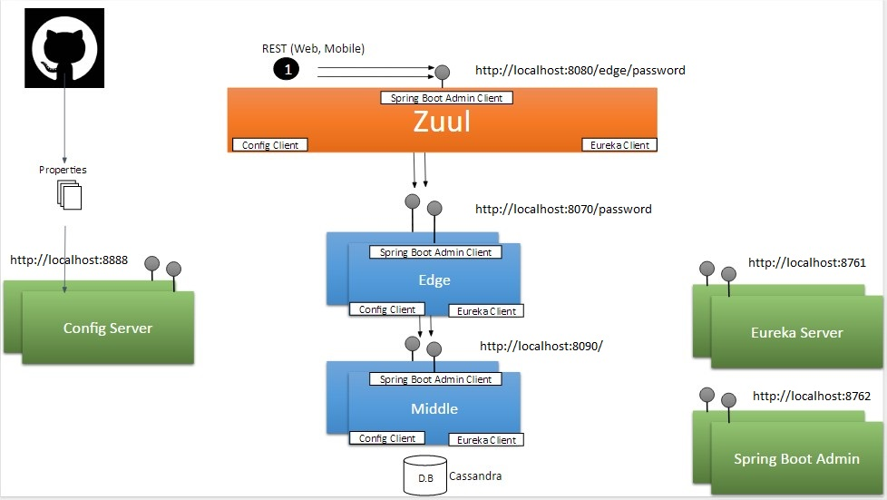

# Crud Microservices

### Goal
Create a code sample with:
* Rest application (SpringBoot);
* Microservices architecture;
* Database Connection;
* Docker

### Rules implementation
 Password security scanner(http://passwordmeter.com);
 I will try create a simple resource, Passwords, that receive a character to analyze and persist.
  
### Stack
* Java
* Maven
* [Spring Cloud Netflix](http://cloud.spring.io/spring-cloud-netflix/spring-cloud-netflix.html)
* [Spring Boot Admin](http://codecentric.github.io/spring-boot-admin/1.4.6/)
* Cassandra
  * [Docker Maven Plugin](https://github.com/spotify/docker-maven-plugin)
* Junit
* [REST-assured](http://rest-assured.io/)
* Mockito
* Docker


### Overview [+](https://docs.google.com/presentation/d/10euTci4EeAG7pqutGsG4zeWMpcl3d74v4EmdWcTPBr0/edit?usp=sharing)

 

 
### Run
##### With Docker
``` 
 cd ../microservices
 mvn clean install
 docker-compose up

``` 
 
##### With Vagrant
``` 
 cd ../microservices/vagrant
 vagrant up
 
```
 
After some minutes, you can visit the client directly at [http://localhost:8080/edge/passwords](http://localhost:8080/edge/passwords) 
The endpoint will show the passwords saved in Cassandra;

```
[]
```

You can create some register in Cassandra;

```
curl \
    -H "Content-Type: application/json" \
    -X POST \
    -d 'simplePassword' \
    http://localhost:8080/edge/passwords
```

This will be return:

```
{
    "passwordCharacters":"simplePassword",
    "score":48,
    "complexity":"Good"
}
```

### Others URLs

 |  Service Name    | Docker Name  | URL                                                                 |
 |------------------|--------------|---------------------------------------------------------------------|
 | SpringBootAdmin  | admin        | [http://localhost:8762](http://localhost:8762)                      |
 | Eureka           | eureka       | [http://localhost:8761](http://localhost:8761)                      |
 | Server Config    | config       | [http://localhost:8888/APPLICATION/PROFILE](http://localhost:8888)  |
 | Zuul             | zuul         | [http://localhost:8080/APPLICATION/RESOURCE](http://localhost:8080) |
 | Edge             | edge         | [http://localhost:8070](http://localhost:8070)                      |
 | Middle           | middle       | [http://localhost:8090](http://localhost:8090)                      |
 | Cassandra        | cassandra    | [tcp://localhost:9042](tcp://localhost:9042)                        |
                                                                                                
                                                                                                
### References
* https://spring.io/guides/gs/centralized-configuration/
* https://spring.io/guides/gs/service-registration-and-discovery/
* https://cloud.spring.io/spring-cloud-config/spring-cloud-config.html

* https://spring.io/guides/gs/routing-and-filtering/
* https://spring.io/blog/2015/01/20/microservice-registration-and-discovery-with-spring-cloud-and-netflix-s-eureka

* https://github.com/materasystems/crud-microservices/
* https://github.com/andreariano/messageexchange-app
* https://github.com/ggoveia/semaphore
* https://github.com/wisner23/microservices-java
* https://github.com/mcwumbly/spring-boot-eureka-example.git

* https://github.com/spring-projects/spring-boot/tree/master/spring-boot-samples/spring-boot-sample-data-cassandra
* http://docs.spring.io/spring-data/cassandra/docs/1.5.1.RELEASE/reference/html/


### TODO
* [x] Finish simple Passwords Resource;
* [x] Save Password in Cassandra;
* [x] Finish Simple Tests;
* [x] Finish docker-compose configuration;
* [x] Connected zuul -> edge -> middle;
* [] Finish some rules;
* [] Include Javadoc;
* [] Fix Server Config; 
* [] Use core module;
* [] Cassandra embedded to simple service automation test;
* [] Fix SpringBootAdmin Details;
* [] Include Hystrix (https://exampledriven.wordpress.com/2016/07/05/spring-cloud-hystrix-example/);
* [] Eureka + SpringBootAdmin;
* [] WireMock can Simplify some Integrations Tests;
* [] ...


